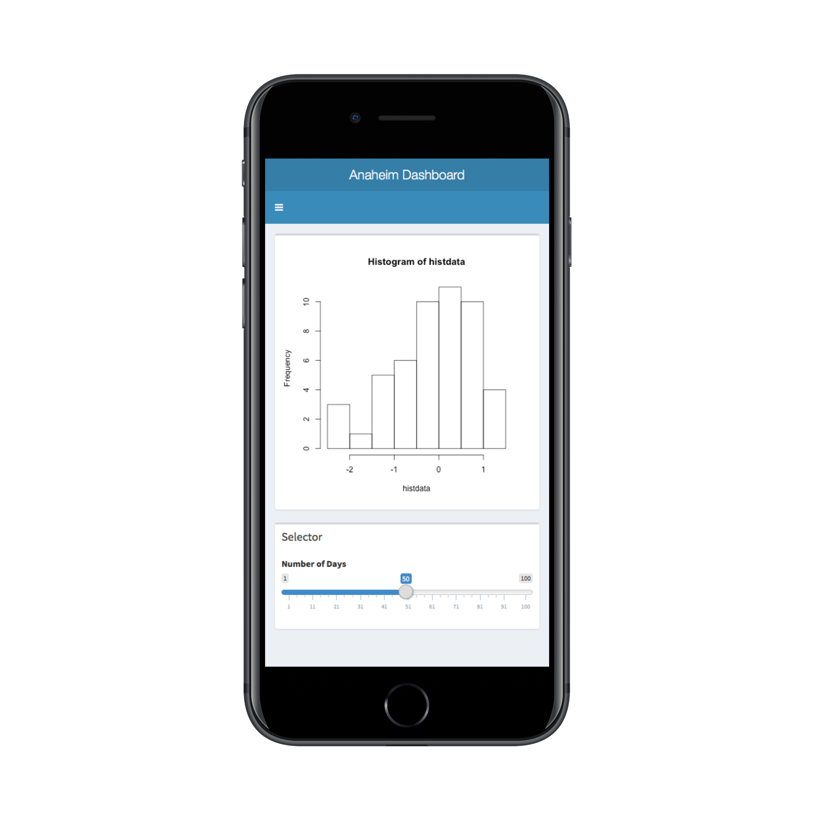
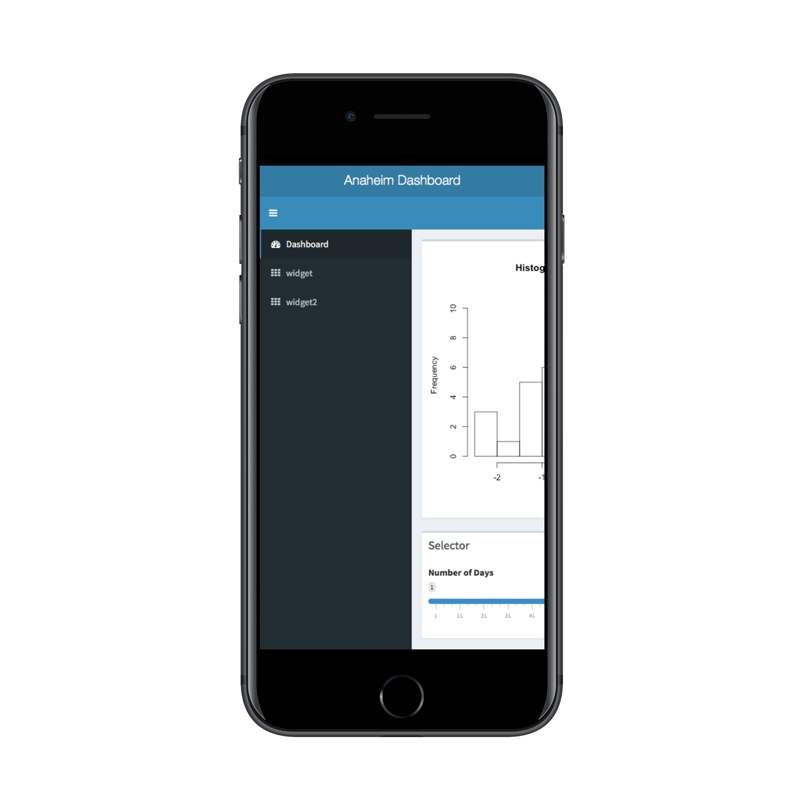

Anaheim Dashboard
-----------------

Anaheim Dashboard is a management dashboard for a Gas or an H2 Station where you can see overal statistics of the station on your phone. You can also choose among over 50 different type of visuallizations based on your needs for more customization.
    You can also export plots as pdf documents, Image files or spreadsheets and use them for other purposes whether it is a presentation or a request for a meeting.  

Few Features: 
*Direct Storage Data  Upload
*Direct File (imgage, pdf document, etc) Download
*Notification Menus
*Value Boxes

